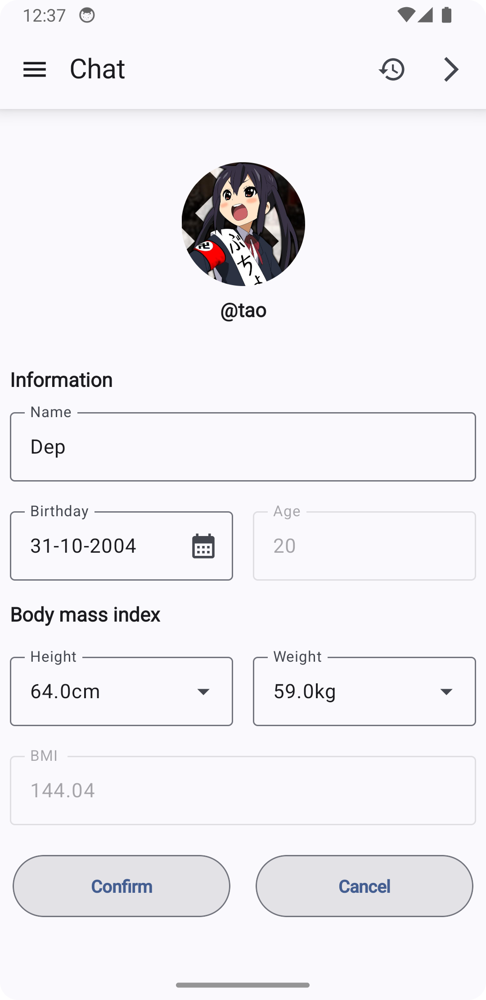
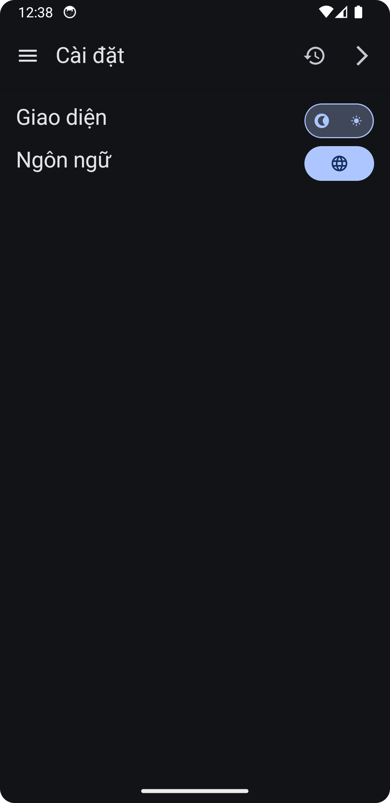
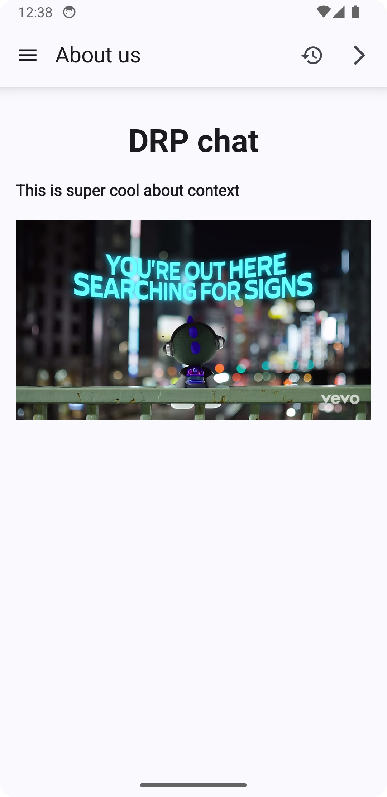
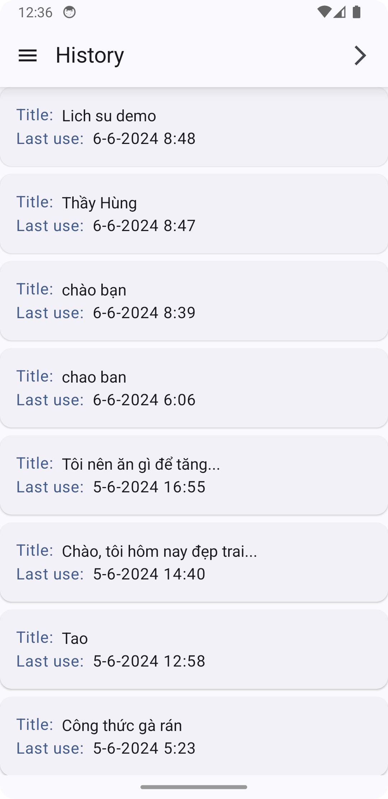
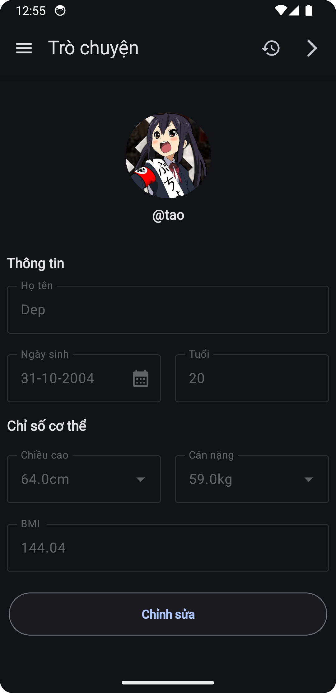
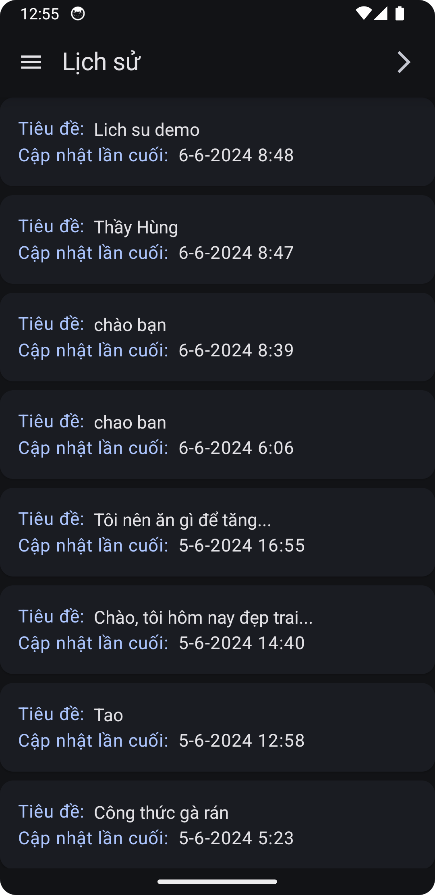
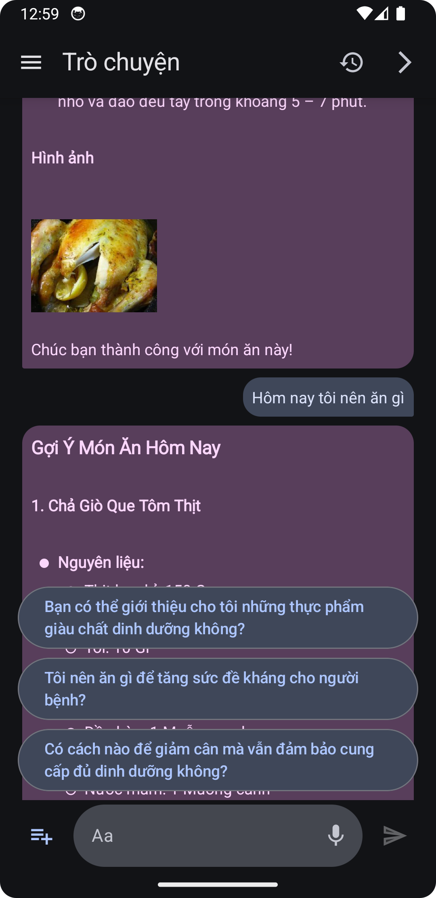

# DRP CHAT BOT 

## Introduction
**An approach to providing a personalized list of suitable dishes for each individual through a friendly way.**

## Architect and utility
### Architect
- Model View View Model
- Clean Architect

### Main libs and Util
**Front end**
- Jetpack compose
- Material3
- Accompanist
- MarkdownText
- Compose Navigation
- Coil - Lottie
- Youtube player

**Back end** 
- Retrofit
- Moshi 
- Dager - Hilt
- Data store
- Room
- Java Jwt

### Main features
- Main chat bot - follow up question
- View history conversations
- Youtube embedded
- Auto login by JWT - Re-login for multiple accounts 
- Sign up / Forgot password with OTP 
- Multilingual support Vietnamese - English
- Dark / Light theme support
- Voice recorgnize chat

## Preview 
|            Profile Screen            |                Home Screen                |                Chat Screen                |
| :----------------------------------: | :---------------------------------------: | :---------------------------------------: |
|             |               |            |

|              Setting Screen          |                About Screen               |                History Screen             |
| :----------------------------------: | :---------------------------------------: | :---------------------------------------: |
|             |                    |                  |

|         Profile Screen Dark          |             History Screen Dark           |             Chat Screen Dark              |
| :----------------------------------: | :---------------------------------------: | :---------------------------------------: |
|        |             |               |
    

**[More detail preview here](https://github.com/JohnHooin/DRP-android-chat-bot/tree/main/showcase)**

